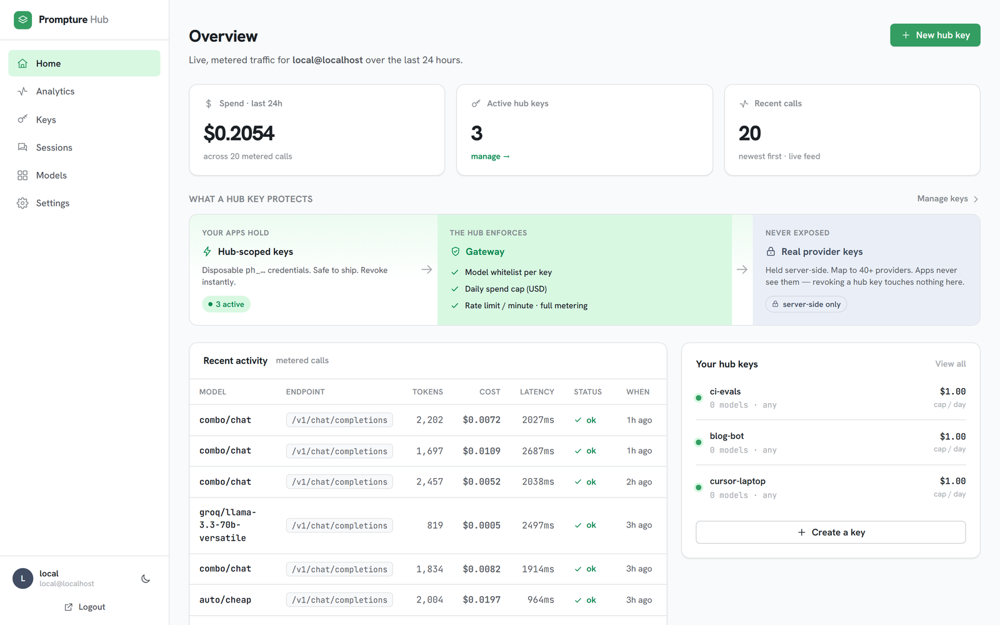
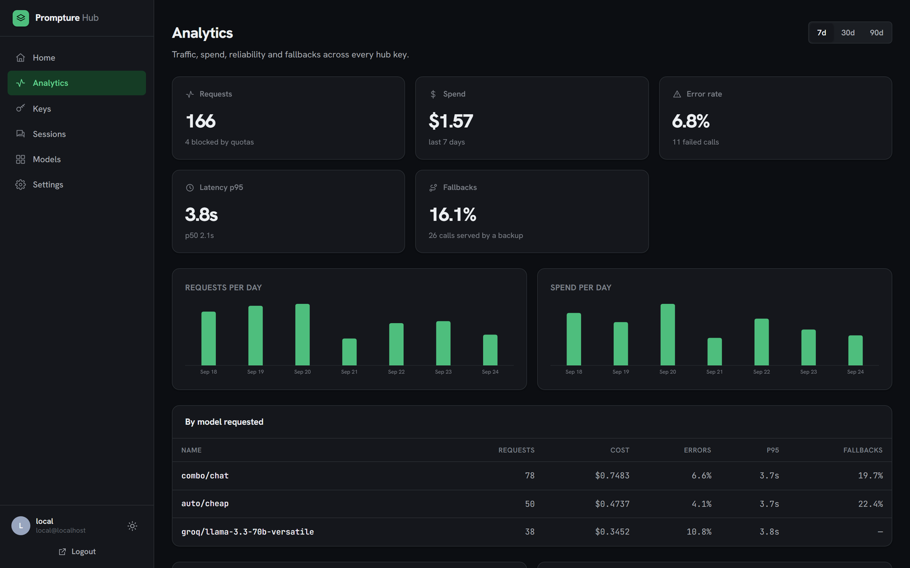
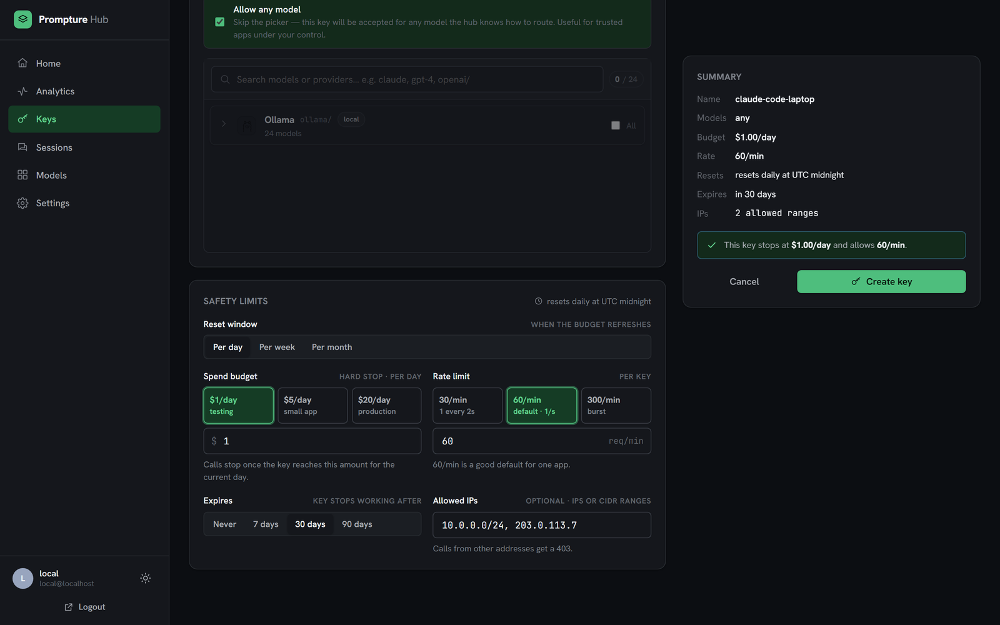
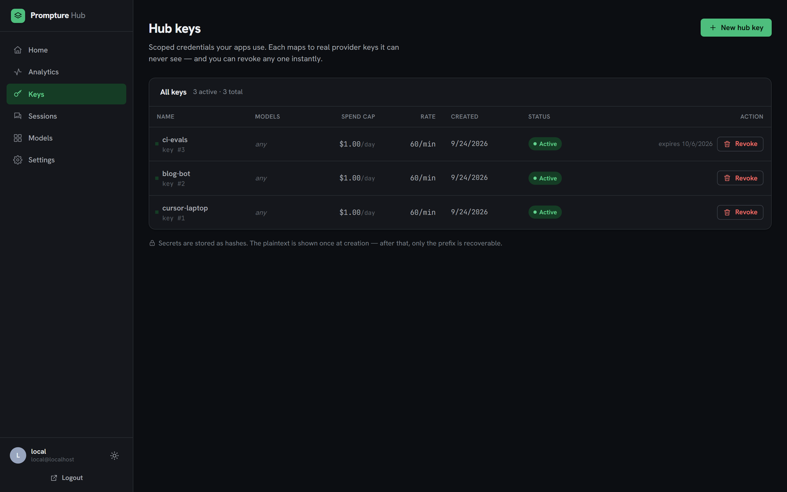
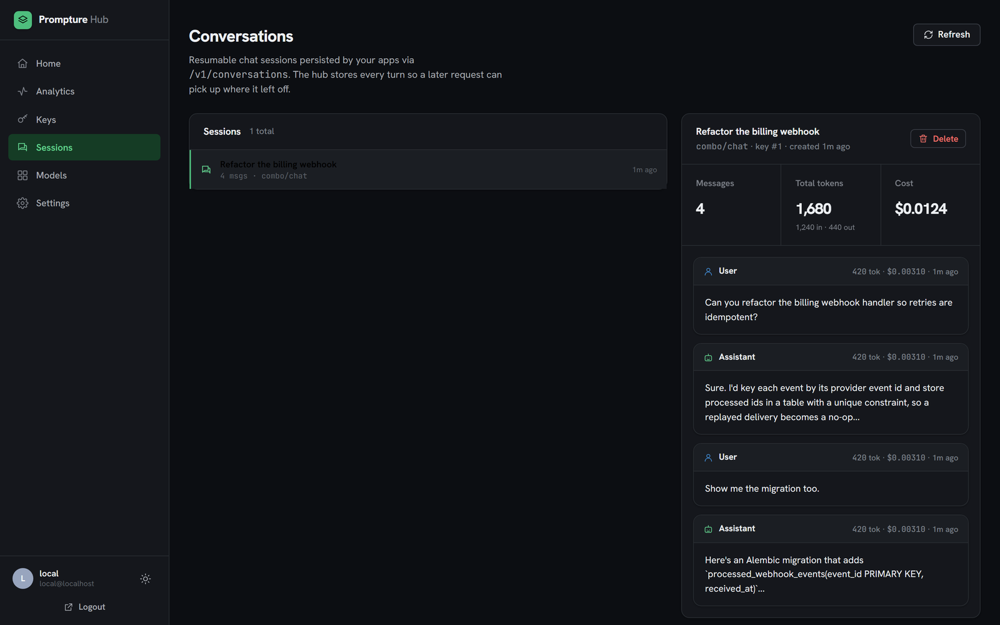

<p align="center">
  <h1 align="center">prompture-hub</h1>
  <p align="center">A self-hosted LLM gateway. Hold the real provider keys server-side, hand out scoped hub keys, meter every call.</p>
</p>

<p align="center">
  <a href="https://opensource.org/licenses/MIT"></a>
  <a href="https://www.python.org/downloads/"></a>
  <a href="https://fastapi.tiangolo.com/"></a>
  <a href="https://github.com/jhd3197/prompture"></a>
  <a href="https://github.com/jhd3197/prompture-hub"></a>
</p>

---

Self-hosted gateway over [Prompture](https://github.com/jhd3197/prompture)'s multi-provider LLM driver registry. Think OpenRouter, except *you* control the keys, the metering, and the trust boundary.

```bash
pip install prompture-hub
```

<picture>
  <source media="(prefers-color-scheme: dark)" srcset="docs/screenshots/dashboard-dark.png">
  
</picture>

<table>
  <tr>
    <td width="50%"><br><sub><b>Analytics</b> — spend, errors, p95 latency and fallback rate by model, provider and key</sub></td>
    <td width="50%"><br><sub><b>Scoped keys</b> — model allowlist, spend cap, rate limit, expiry and IP allowlist</sub></td>
  </tr>
  <tr>
    <td width="50%"><br><sub><b>Keys</b> — revoke instantly; expired keys stop working on their own</sub></td>
    <td width="50%"><br><sub><b>Sessions</b> — resumable conversations with per-turn tokens and cost</sub></td>
  </tr>
</table>

## Why this exists

You have provider API keys (OpenAI, Anthropic, Groq, Ollama, etc.). You want to let other apps — including apps you don't fully trust — call LLMs *through* your keys, with per-app limits and observability, **without** ever handing those apps the real provider keys.

`prompture-hub` does that by:

1. Holding the real provider keys server-side (loaded once from `.env`)
2. Issuing **hub-scoped API keys** that untrusted apps use
3. Enforcing per-key allowed-model whitelists, daily spend caps, and rate limits
4. Recording every call (cost, latency, tokens) for the dashboard

The untrusted app never sees `OPENAI_API_KEY` (or any other real provider secret). If you revoke its hub key, it's locked out instantly — no scrambling to rotate provider keys.

## Status

**v0.0.2** — solo / localhost / SQLite, [published on PyPI](https://pypi.org/project/prompture-hub/). The architecture (auth, key model, storage) is designed to extend to multi-user and public deployment later without rewriting the v0.x surface.

## Install

```bash
pip install prompture-hub
```

Already using Prompture? `pip install "prompture[hub]"` installs the same thing, and `prompture hub` launches it.

The dashboard UI ships **prebuilt inside the package** — no Node, no npm, no checkout required. (Prefer an isolated install? `pipx install prompture-hub`.)

Point it at one provider key and launch:

```bash
# create a minimal .env in your working directory
python -c "import secrets; print('HUB_ADMIN_TOKEN=' + secrets.token_urlsafe(32))" >> .env
echo "OPENAI_API_KEY=sk-..." >> .env                     # any provider Prompture supports
echo "OLLAMA_BASE_URL=http://localhost:11434" >> .env    # local models work too

prompture-hub
```

Open **http://localhost:1984/** — you'll land on the dashboard at `/app/`. See [`.env.example`](.env.example) for every setting (OAuth login, spend caps, all provider keys).

> [!IMPORTANT]
> **Run it natively, not in a container.** Because `prompture-hub` runs as a normal
> process on your host, it can reach model servers on `localhost` — Ollama (`:11434`),
> LM Studio (`:1234`), and friends. A Dockerized hub can't see those host-local
> servers without extra networking (see [Run in a container](#run-in-a-container-secondary)).

<details>
<summary><b>Run from source (for development)</b></summary>

You only need this if you're hacking on the hub itself — it requires Node to build the dashboard.

```bash
git clone https://github.com/jhd3197/prompture-hub
cd prompture-hub
pip install -e ".[dev]"
cp .env.example .env            # fill in HUB_ADMIN_TOKEN + provider keys

cd frontend && npm install && npm run build && cd ..   # build the dashboard
uvicorn prompture_hub.main:app --reload                # http://localhost:1984
```

For live frontend reload, run `npm run dev` inside `frontend/` (it proxies to the API on :1984) instead of the one-off build.
</details>

Then create a scoped key for an untrusted app:

```bash
curl -X POST http://localhost:1984/admin/keys \
  -H "Authorization: Bearer $HUB_ADMIN_TOKEN" \
  -H "Content-Type: application/json" \
  -d '{
    "name": "sketchy-app",
    "allowed_models": ["ollama/llama3.1:8b"],
    "daily_spend_cap_usd": 1.0,
    "rate_limit_per_min": 30
  }'
```

The response includes the plaintext key once — copy it now, you cannot retrieve it again. Hand it to the untrusted app. From inside that app:

```bash
curl http://localhost:1984/v1/chat/completions \
  -H "Authorization: Bearer ph_xxxxxxxxxxxx" \
  -H "Content-Type: application/json" \
  -d '{
    "model": "ollama/llama3.1:8b",
    "messages": [{"role": "user", "content": "hi"}]
  }'
```

The dashboard lives at `http://localhost:1984/` and shows recent keys, recent calls, and 24-hour spend.

## API surfaces

| Surface | Endpoints | Use case |
|---|---|---|
| **OpenAI-compatible** | `/v1/chat/completions`, `/v1/models` | Drop-in for any OpenAI-SDK client: `tools`, `image_url` parts, `response_format` and streaming all pass through. Wire format comes from `prompture.gateway`, so it matches `prompture serve` exactly. |
| **OpenAI Responses** | `/v1/responses` | What Codex CLI speaks. Function calls + streaming; stateless (`previous_response_id` is rejected — send full `input`). |
| **Anthropic-compatible** | `/v1/messages`, `/v1/messages/count_tokens` | What Claude Code and the Anthropic SDKs speak. Tools + streaming. Bare ids like `claude-sonnet-4-5` route to Prompture's `claude/` driver; anything else (`combo/…`, `auto/…`, `openai/gpt-4o`) works too. Key via `x-api-key` or bearer. |
| **Embeddings** | `/v1/embeddings` | Prompture's embedding drivers, metered per key. |
| **Prompture-native** | `/v1/extract` | Structured extraction with JSON Schema. Exposes Prompture's `ask_for_json` + strategies (`provider_native`, `tool_call`, `prompted_repair`) over HTTP. |
| **Sessions** | `/v1/conversations` (CRUD) + `conversation_id` on `/v1/chat/completions` | Resumable chat: a later request replays prior turns server-side so the client doesn't need to ship full history. |
| **Companion** | `/v1/companion/info`, `/v1/companion/device/*`, `/v1/live`, `/v1/limits`, `/v1/spend`, `/v1/alerts`, `/v1/keys/{id}` | For desktop companions and status widgets: device pairing, a live stream of calls, headroom, spend and alerts, plus key controls. See [Companion API](#companion-api). |

Every chat surface accepts Prompture's virtual model names — `combo/<name>` fallback chains, `auto/cheap` / `auto/best`, aliases and `fusion/<name>` — so retries, key rotation and failover happen inside the hub. Each usage row records which model actually served the call and how many attempts it took.

### Connect your tools

`prompture-hub setup <tool>` prints exactly what a tool needs to go through the hub (env vars for bash and PowerShell, or a config snippet):

```bash
prompture-hub setup claude-code --create-key --model combo/chat   # mint a key + print env
prompture-hub setup claude-code --key ph_... --write               # merge into ~/.claude/settings.json (backed up first)
prompture-hub setup codex --key ph_... --model auto/best            # ~/.codex/config.toml snippet (Responses API)
prompture-hub setup aider | cursor | continue | openai | anthropic
prompture-hub setup claude-code --key ph_... --project . --write   # tag this folder's spend (see Projects)
```

### Projects

Send `X-Project: <name>` on any `/v1/*` call (or give a key a `default_project`) and its spend is attributed to that project: analytics gets a *By project* breakdown and `?project=` filter, and `/v1/spend` splits by project. `setup --project NAME` configures the header per tool (`--project .` uses the current folder name). Claude Code gets it in the folder's `.claude/settings.local.json`, Codex in `http_headers`, Continue in `requestOptions`. For tools that can't send headers, `--create-key --project NAME` mints a key with that default.

### Resumable sessions

Create a conversation, then reference its id on subsequent `/v1/chat/completions` calls:

```bash
# 1. open a session (optionally with a system prompt)
curl -X POST http://localhost:1984/v1/conversations \
  -H "Authorization: Bearer ph_xxxxxxxxxxxx" \
  -H "Content-Type: application/json" \
  -d '{"title": "seo-audit-run", "system": "You are an SEO auditor."}'
# => { "id": "conv_...", ... }

# 2. talk to it; prior turns are loaded automatically
curl http://localhost:1984/v1/chat/completions \
  -H "Authorization: Bearer ph_xxxxxxxxxxxx" \
  -H "Content-Type: application/json" \
  -d '{
    "model": "ollama/llama3.1:8b",
    "conversation_id": "conv_...",
    "messages": [{"role": "user", "content": "Audit example.com"}]
  }'

# 3. inspect history later
curl http://localhost:1984/v1/conversations/conv_... \
  -H "Authorization: Bearer ph_xxxxxxxxxxxx"
```

Set `"persist": false` on a chat request to use the session as read-only history without recording the new turn. Conversations are scoped to the HubKey that created them.

## Companion API

Endpoints for desktop companions, tray apps and status widgets. They report on the hub; they can't call models.

**[Prompture Desk](https://github.com/jhd3197/Prompture-Desk)** is the desktop companion built on them: pair it once and see spend, headroom and running calls from your tray, then pause keys or providers without opening the dashboard.

<p align="center">
  
  
</p>

**Pairing** follows the OAuth 2.0 Device Authorization Grant (RFC 8628). No password is typed on the device:

1. The device calls `POST /v1/companion/device/code` with `scope` set to `read` or `read control`, and shows the returned `user_code`.
2. You open `/app/pair?code=…` in the dashboard (or type the code there) and approve. You can downgrade the request to read-only.
3. The device polls `POST /v1/companion/device/token` until it receives a `phd_…` token.

Tokens are listed and revocable under **Settings › Devices**. `GET /v1/companion/info` is public and reports the hub version, API version and features, so a companion can adapt before it pairs.

| Endpoint | Scope | What it returns |
|---|---|---|
| `GET /v1/live` | read | Server-Sent Events: `request.started`, `request.first_token`, `request.activity` (coding agents: working vs waiting), `request.finished`, `key.updated`, `alert.fired`. On connect you get a `snapshot` of running calls. Missed events replay from `Last-Event-ID`. Metadata only: no prompt or completion text. |
| `GET /v1/limits` | read | Each key's spend cap and rate limit, provider rate-limit headroom (from the headers providers send on every response) and provider account balances. Every figure says where it came from. |
| `GET /v1/spend?period=day\|week\|month` | read | Spend in the current UTC period, split by project, key and model. |
| `GET /v1/alerts` | read | Recent alerts. `POST /v1/alerts/{id}/ack` needs control scope. |
| `POST /v1/keys/{id}/pause` · `/resume` · `PATCH /v1/keys/{id}` | control | Pause a key, set a route override (serve every chat call on the key with a chosen model or combo), or change its cap, period or default project. |

The dashboard session and `HUB_ADMIN_TOKEN` also work on these endpoints. When dashboard login is on, a device paired by a user sees only that user's keys. Provider headroom and account balances are shown only to callers who can see every key.

### Alerts

Rules are set under **Settings › Alerts** (`/api/alerts/rules`). Each rule watches for one of:

- **key spend**: a share of a key's cap is used. The default is Prompture's budget degrade threshold.
- **provider rate-limit headroom**: little of a window is left. The default is Prompture's routing `min_headroom`.
- **low account balance**
- **fallbacks**
- **failed calls**

Fired alerts are stored, appear on `/v1/live`, and can also post to a webhook or an [ntfy](https://ntfy.sh) topic. A rule repeats at most once per its cooldown.

### Custom endpoints

Register any OpenAI-compatible server (vLLM, llama.cpp, a private gateway) under **Settings › Endpoints** (`/api/endpoints`). Its models are served as `openai_compatible/<name>/<model>`. They're metered, attributed and alerted on like built-in providers, and listed in `/v1/models` after a health check. The hub stores only the *name* of the env var that holds the endpoint's key, never the key itself.

## Dashboard login (Google / GitHub OAuth)

The HTML dashboard at `/` is gated behind OAuth login when configured. Programmatic clients (`/v1/*`, `/admin/*`) are unaffected — they keep using hub-issued keys / `HUB_ADMIN_TOKEN`.

**Setup:**

1. Generate a session secret:
   ```bash
   python -c "import secrets;print(secrets.token_urlsafe(48))"
   ```
   Put it in `.env` as `HUB_SESSION_SECRET=...`.

2. Set your public URL — this is what OAuth providers will redirect back to:
   ```env
   HUB_BASE_URL=http://localhost:1984        # or https://hub.yourdomain.com
   ```

3. Set the **allowlist** (emails that may log in). Empty = nobody can log in.
   ```env
   HUB_ALLOWED_EMAILS=you@example.com,teammate@example.com
   ```

4. Create the OAuth apps you want (one or both):

   **Google** — https://console.cloud.google.com/apis/credentials → OAuth client ID → Web application
   - Authorized redirect URI: `{HUB_BASE_URL}/auth/google/callback`
   - Paste the client id/secret into `HUB_GOOGLE_CLIENT_ID` / `HUB_GOOGLE_CLIENT_SECRET`

   **GitHub** — https://github.com/settings/developers → New OAuth App
   - Authorization callback URL: `{HUB_BASE_URL}/auth/github/callback`
   - Paste into `HUB_GITHUB_CLIENT_ID` / `HUB_GITHUB_CLIENT_SECRET`

5. Restart the hub. Visit `/` and you'll be redirected to `/auth/login`.

**Fallback (dev-only):** if `HUB_SESSION_SECRET` is empty *or* neither OAuth provider is configured, login is disabled and `require_user` falls back to localhost-open mode — convenient for solo dev, **never** safe for a public deployment. Always set a session secret + provider + allowlist before exposing the hub.

## Run in a container (secondary)

> [!WARNING]
> A containerized hub **cannot reach model servers on your host's `localhost`**
> (Ollama, LM Studio, etc.). Use the native `pip install` above if you rely on
> local models. Containers are best when you only call **remote** providers
> (OpenAI, Anthropic, Groq, …) or run your model server in another container.

```bash
cp .env.example .env
# fill HUB_ADMIN_TOKEN + provider keys

docker compose up -d --build
docker compose logs -f hub
curl http://localhost:1984/health
```

The container runs as non-root `hub` (uid 10001), persists SQLite at `/data/prompture_hub.db` via the `hub_data` volume, binds `0.0.0.0:1984`, and has a `/health` healthcheck.

**Reaching host-local model servers from the container:**

- **Linux:** add `network_mode: host` to the `hub` service so it shares the host's localhost, or
- **macOS / Windows / Linux:** point provider base URLs at the host gateway, e.g. `OLLAMA_BASE_URL=http://host.docker.internal:11434`.

For a public deployment, put it behind nginx/Caddy with TLS and rate limits — don't expose port 1984 to the internet directly.

## Architecture

```
prompture-hub/
├── src/prompture_hub/
│   ├── main.py              FastAPI app factory + SPA mount + uvicorn CLI
│   ├── settings.py          HubSettings (admin_token, db_path, host/port, OAuth)
│   ├── auth.py              require_admin / require_hub_key / require_user
│   ├── oauth.py             Authlib OAuth registry (Google + GitHub)
│   ├── routers/
│   │   ├── openai_compat.py /v1/chat/completions, /v1/models
│   │   ├── extract.py       /v1/extract (Prompture-native)
│   │   ├── conversations.py /v1/conversations (resumable sessions)
│   │   ├── admin.py         /admin/keys CRUD + /admin/usage
│   │   ├── auth.py          /auth/{google,github}/start + /callback + /logout
│   │   └── spa_api.py       /api/* — JSON consumed by the React SPA
│   ├── storage/
│   │   ├── db.py            SQLite engine + session factory + init_db (auto-migrate)
│   │   └── models.py        HubKey, UsageRecord, User, Conversation, Message
│   ├── migrations/          Alembic env + versions/ (ships in the wheel; auto-applied on boot)
│   └── static/
│       └── app/             Built SPA bundle (bundled into the package at build time)
└── frontend/                Vite + React + TypeScript dashboard
    └── src/
        ├── components/      Sidebar, Modal, Toast, StatCard, TrustFlow, …
        ├── pages/           LoginPage, Dashboard, KeysPage, ModelsPage
        ├── api.ts           Typed fetch wrappers
        └── styles.css       Design system (light + dark via [data-theme])
```

### Migrations

**You never run migrations.** The schema is managed by [Alembic](https://alembic.sqlalchemy.org/), and the migration environment ships *inside the package* (`prompture_hub/migrations/`). On every boot the app runs `alembic upgrade head` programmatically — a fresh database gets the full schema, an existing one gets only the migrations it's missing. Upgrading is just `pip install -U prompture-hub` (or pulling a newer image); the next start self-migrates.

<details>
<summary><b>Maintainers only</b> — authoring a migration after a model change</summary>

After changing a model in `src/prompture_hub/storage/models.py`, generate a migration and commit it so it ships (and auto-applies) with the next release:

```bash
alembic revision --autogenerate -m "add foo column to hubkey"
# Review the generated file in src/prompture_hub/migrations/versions/ —
# autogenerate is a hint, not a substitute for reading the SQL it emits.
```
</details>

If you have an old SQLite from before Alembic was introduced and it
already has tables but no `alembic_version` row, the cleanest path is to
delete it and let init_db create the new schema fresh:

```bash
rm prompture_hub*.db
```

### Frontend dev loop

```bash
cd frontend
npm run dev        # http://localhost:1985  (proxies /api, /auth, /v1 to FastAPI)
```

The Vite dev server proxies all backend paths (`/api`, `/auth`, `/v1`, `/admin`, `/docs`, `/health`) to `http://127.0.0.1:1984`, so you can run uvicorn + vite side by side with hot reload on both.

## Security model

- **Hub-issued keys** are 32-byte URL-safe tokens, prefixed `ph_`. Only the SHA-256 hash is stored; plaintext is returned to the caller once at creation.
- **Admin endpoints** (`/admin/*`) require `Authorization: Bearer $HUB_ADMIN_TOKEN`. Different credential from hub-issued keys — separation of duties.
- **Real provider keys** (`OPENAI_API_KEY`, etc.) are read directly by Prompture's drivers from environment. They never appear in any HTTP response.
- **Per-key policies**: model allowlist, spend cap per day/week/month, rate limit, optional **expiry** and **IP / CIDR allowlist**. `X-Forwarded-For` is only honored with `HUB_TRUST_PROXY_HEADERS=true`.
- **Localhost-only by default**: `HUB_HOST=127.0.0.1`. Public exposure requires a reverse proxy + TLS.
- **Device tokens** (`phd_…`) are hashed like hub keys and can never call models. `control` scope is granted separately at approval time. Pending pairings expire after 10 minutes and are capped in number.
- **Live events** carry metadata only: ids, model, project, status, tokens, cost, timings. Prompt and completion text never reach `/v1/live`. Behind a reverse proxy, disable response buffering for `/v1/live`.

## Analytics

The dashboard's **Analytics** page (and `GET /api/analytics?days=7|30|90`) shows requests, spend, error rate, p50/p95 latency and fallback rate per day, broken down by requested model, serving provider and hub key, plus the most recent errors.

## Roadmap

**Shipped:** OpenAI chat completions, Responses API and Anthropic Messages API (streaming + tools), embeddings, `/v1/extract`, combos / `auto/` / fusion routing with per-call route metering, scoped keys (model allowlist, spend caps, rate limits, expiry, IP allowlists, pause, route override), analytics dashboard, per-project attribution, `setup` command for coding tools, reasoning replay, optional prompt compression, resumable conversations, coding-agent runner, OAuth login, Alembic migrations, companion API (device pairing, live stream, limits, spend, alerts, key controls), custom OpenAI-compatible endpoints.

**Next:**
- Combo / alias management in the dashboard (today: `PROMPTURE_COMBOS_FILE`)
- Multi-user and hosted deployments — Postgres backend, audit log
- `previous_response_id` support for `/v1/responses`

## License

MIT
